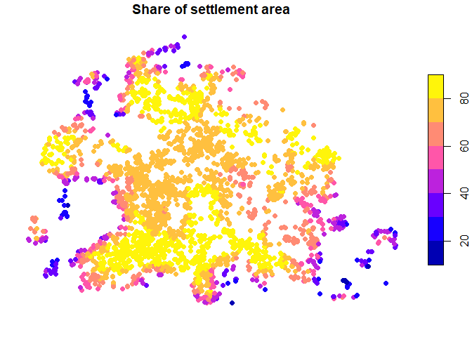

<!-- README.md is generated from README.Rmd. Please edit that file -->

# SoRa in R 

<!-- badges: startdata:image/png;base64,iVBORw0KGgoAAAANSUhEUgAAABIAAAASCAYAAABWzo5XAAAAbElEQVR4Xs2RQQrAMAgEfZgf7W9LAguybljJpR3wEse5JOL3ZObDb4x1loDhHbBOFU6i2Ddnw2KNiXcdAXygJlwE8OFVBHDgKrLgSInN4WMe9iXiqIVsTMjH7z/GhNTEibOxQswcYIWYOR/zAjBJfiXh3jZ6AAAAAElFTkSuQmCC -->

<a href="https://git.gesis.org/soraplus/sora-r/-/pipelines"></a>
<a href="https://git.gesis.org/soraplus/sora-r/-/tree/main/tests/testthat"></a>


<!-- badges: end -->

`{sora}` is the official R package of the SoRa Geolinking Service.
Easily link georeferenced survey data with its spatial context.
Interactively select datasets, create and manage linking jobs, and
retrieve results. Create persistent provenance records facilitating the
reproducibility of social-spatial research.

The package knows two modes, depending on where you are:

- If you bring your data or structural datasets, use the **public
  API**
- If you work on sensitive survey data in secure rooms, use the
  **private API** (follow the instructions of the staff)

## Installation

You can install the development version of `sora` like so:

``` r
# install.packages("pak")
pak::pkg_install("git::https://git.gesis.org/soraplus/sora-r.git")
```

## What does SoRa do?

SoRa does one thing: It links a survey dataset (or any other geocoded
dataset) to a spatial dataset using a set of linking methods. The
datasets can be either provided by you or by the SoRa infrastructure.
SoRa can work both with publicly available data and with sensitive
micro data inside secure rooms.

The workflow is rather straightforward:

- Select a linking design, e.g., by using the [data
  picker](https://sora.gesis.org/unofficial/datapicker/)
- Check if SoRa is up and running: `sora_available()`
- Send a request: `sora_request()`
- Wait until your request has been handled: `sora_wait()`
- Fetch the results: `sora_results()`

## Access to the API

Before you can use the SoRa API, make sure to request an API key under
[this
link](https://sora.gesis.org/unofficial/sora-user-mod/users/request-api-key).

You will have to provide some personal information and, importantly,
agree to the mandatory and optional agreements. Optional agreements are
made with the service providers and are a requirement to use their
service. For example, if you do not agree to the user agreement of the
IOER, then you will not be able to use their services within SoRa.

Please ensure that you never publish your API key to the public in plain
text. This also includes uploads of any kind, such as those to GitHub. The
package functions feature an `api_key` argument, but you are advised never to use it. Instead, we suggest using one of the following options:

- Set an environment variable `SORA_API_KEY` in your `.Renviron` file
  (see
  [here](https://docs.posit.co/ide/user/ide/guide/environments/r/managing-r.html#renviron)
  to learn more about `.Renviron` files)
- Pass `api_key = "ask"` to any SoRa function. This will open up a
  masked prompt where you can enter your API key safely. You must only
  do this once per session.

## Inside a secure room

One of the strengths of SoRa is that you can use it both publicly and
inside the secure room of a research data centre (RDC). The SoRa project
maintains several secure connections to service providers that can
be used in the air-gapped networks of RDCs. Read the [vignette on secure
rooms](http://soraplus.git.gesis.org/sora-r/#/vignettes/d-secure-rooms.md)
to learn more about this.

## Example

This is a basic example which shows you how to solve a common problem.
First, make sure you attach the `{sora}` package to the session. For
this example, we use the synthetic `ber_income` dataset. See
`?ber_income` for details.

``` r
library(sora)
head(ber_income)
#>         id      income       x       y
#> 1 ID_08939 4500-5000 € 4558400 3278000
#> 2 ID_29396 3500-4000 € 4549700 3277800
#> 3 ID_20257 2500-3000 € 4546200 3265100
#> 4 ID_12550 3000-3500 € 4548100 3268000
#> 5 ID_22042 4500-5000 € 4542700 3262900
#> 6 ID_15074 3000-3500 € 4561600 3276700
```

Before you send requests, make sure to [sign up for an API
key](https://sora.gesis.org/unofficial/sora-user-mod/users/request-api-key).
You will only be able to use data for which you signed the necessary usage
agreements. To see whether the API is available and your key is
valid, you can run `sora_available()`. If it returns `TRUE`, you are
good to go.

``` r
sora_available()
#> [1] TRUE
```

SoRa accepts three types of survey datasets. You can either provide the
IDs of the dataset provided by SoRa, provide your datasets, or use
identifiers of administrative areas in Germany (e.g., zip codes or
municipality keys). For our dummy example, we use `sora_custom` to
signal that we use our data.

``` r
survey_data <- sora_custom(ber_income, crs = 3035)
survey_data
#> <sora_custom>
#> Using custom data with EPSG code 3035. 
#> 
#>          id       x       y
#> 1  ID_08939 4558400 3278000
#> 2  ID_29396 4549700 3277800
#> 3  ID_20257 4546200 3265100
#> 4  ID_12550 4548100 3268000
#> 5  ID_22042 4542700 3262900
#> 6  ID_15074 4561600 3276700
#> 7  ID_09514 4539700 3279600
#> 8  ID_15498 4567000 3266900
#> 9  ID_12606 4558700 3275800
#> 10 ID_26172 4542200 3262000
```

To send a linking request to the SoRa API, simply chuck your prepared
dataset into `sora_request()` and specify the spatial data you would like to
link it to. Here, we use an indicator on settlement area share in a
region provided by the [IOER monitor](https://monitor.ioer.de/). You can
check out all available datasets in the [data
picker](https://sora.gesis.org/unofficial/datapicker/).

``` r
linked <- sora_request(
  survey_data,
  link_to = "ioer-monitor-s02rg-2023-1000m",
  method = "aggregate_attribute",
  selection_area = "square",
  length = 2500,
  output = c("mean", "median", "sd"),
  wait = TRUE
)
#> → The provided coordinates have unique identifiers and are in a valid format.
#> → The requested sora-provided geospatial dataset exists.
#> → Chosen geospatial dataset: Percentage of settlement area to reference area
#>   (2023, 1000m Raster) from IOER-Monitor (IOER)
#> → Chosen linkage: Aggregate attribute within square on raster with numeric
#>   field - Geocoded Dataset: Vector: Point | Geospatial Dataset: Raster -
#>   numeric
#> → The requested linkage is plausible and fits the chosen geospatial dataset.
#>   All provided parameters are valid, including their values.
#> → All required permissions for accessing the data are available.
#> → Total number of provided coordinates: 3000 (valid: 3000, having null values:
#>   0).
#> → Number of coordinates located within the bounding box of the geospatial dataset:
#>   3000 (outside: 0).
#> → All required external services are available.
#> Waiting for results...
#> → The requested linkage was successfully executed.
```

``` r
linked
#> # A tibble: 3,000 × 6
#>    id          area  mean median    sd count
#>    <chr>      <dbl> <dbl>  <dbl> <dbl> <int>
#>  1 ID_08939 6250000  79.5   80.4  6.72     6
#>  2 ID_29396 6250000  82.0   82.2  3.92     6
#>  3 ID_20257 6250000  82.4   84.2  5.93     4
#>  4 ID_12550 6250000  69.7   70.4  4.33     4
#>  5 ID_22042 6250000  83.7   83.7  2.22     6
#>  6 ID_15074 6250000  73.8   74.6 10.4      9
#>  7 ID_09514 6250000  29.1   22.9 19.8      9
#>  8 ID_15498 6250000  52.0   49.1 24.8      4
#>  9 ID_12606 6250000  81.4   80.5  5.44     6
#> 10 ID_26172 6250000  80.6   83.0  7.37     4
#> # ℹ 2,990 more rows
```

``` r
library(sf)

linked <- merge(ber_income, linked, by = "id")
linked <- st_as_sf(linked, coords = c("x", "y"), crs = 3035)
plot(linked["mean"], pch = 16, main = "Share of settlement area")
```



To construct more complex queries, make sure to read the package
vignettes. You may be wondering:

- How do I know what spatial data is available? Read the introduction to
  the [data
  picker](http://soraplus.git.gesis.org/sora-r/#/vignettes/a-data_picker.md)
- How do I make requests that fit my use case? Read the introduction on
  how to make [SoRa
  requests](http://soraplus.git.gesis.org/sora-r/#/vignettes/b-request.md)
- Can I provide my spatial data? Read the vignette on [alternative
  spatial data
  sources](http://soraplus.git.gesis.org/sora-r/#/vignettes/c-custom_data.md)
- How do I use SoRa inside a research data centre? Read the vignette on
  the integration of SoRa in [secure
  rooms](http://soraplus.git.gesis.org/sora-r/#/vignettes/d-secure-rooms.md)
